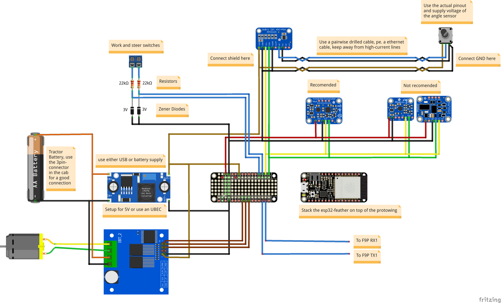

# esp32-aog
Software to control the tractor from AgOpenGPS.

# Updates/changes from [eringerli](https://github.com/eringerli/esp32-aog) codebase
## Note some docs in the Readme are no longer correct, it is being worked on.

* All GPIOs are hardcoded because the WebUI was overloaded from all the features being added
* A configurable speed safety will disengage autosteer when traveling too fast
* Added Ackerman, selectable if wheel with WAS is on the inside track or outside track when the wheel angle is above zero
* A steering wheel input GPIO will disengage autosteer if steering wheel is turned, you can set trigger time window and total triggers
* The ESP32 will create a Wifi hotspot and try to connect to the main Wifi. If main Wifi is found, ESP32 hotspot will discontinue. If ESP32 hotspot is connected to, main Wifi will no longer try to connect
* ESP32 hotspot will be called Steer Module XXXXXX. with the MAC address of the ESP32 appended to avoid confusion between multiple ESP32s
* Only one ESP32 can connect to the same Wifi. The ESP32 pings any existing device at 192.168.xxx.77 and disconnects if a device is already on the network. This way AOG does not receive conflicting info from 2 different machine modules. Yes, this actually happens!!!
* If the Wifi name is shorter than the default, it will work as expected.
* Valves with 2 coils have option of using dither
* The voltage reference can be set for 3.3V applications, or lower
* Faults will be recorded if autosteer is engaged without steering valve power, or fuse is blown, or WAS is shorted
* Steering valve diagnostics are shown in WebUI
* The ADS1115 A2 and A3 input are repurposed for steering valve voltage and motor current

# Features
* complete rewrite of the software for the physical part of AgOpenGPS. Uses a multi-threaded aproach. Tries to use other libraries as much as possible and is clearly structured with meaningful names
* Cool and comfortable WebUI, automatically creates a hotspot on first start, the Wifi to connect to can be configured in the WebUI
* Everything is configured from the WebUI. Sane defaults are used: everything has to be activated to work, like PWM-drivers or IMUs
* Settings are stored into flash on user request. New features normally require an apply&reboot cycle to activate, the WebUI clearly shows this.
* Status and values like uptime, processor load, and wheel angle are actualised in realtime in the WebUI
* CAN-bus/J1939-connection possible, so the workswitch can be configured to react on PTO or motor RPMs or hitch positions
* The wheel angle sensor can be configured via ADS1115 to enable single or differential measurement
* A new mode for the wheel angle sensor is introduced, to calculate out the unlinearities if connected with two arms to the tie rod
* A complete new PID-controller is implemented
* All analog measurements are digitaly low-pass filtered (2. order butterworth or similar), this removes a lot of noise.

# Caveats
* For best results, use the machine control board found in the [Github repo](https://github.com/AOG-addendum/PCB-modules/tree/master/Machine%20control)
* **As the WebUI is quite taxing on the Websocket implementation; the ESP32 can crash without warning if left too long connected. Without open connection to a browser, no such crashes are documented. On my hardware, a longtime stresstest of more the five days of uptime was completed successfully, if the tab with the WebUI is closed after using it.** The cause of the crashes is in the implementation of the used TCP-stack/Websocket-API. Not much can be done about it, as it is the default implementation which comes with framework (ESPAsyncWebServer), is really fast/performant and is used by the library to generate the WebUI.
* No configuration is done in AgOpenGPS, everything is configured in the WebUI. Technical explanation: some of the settings in AgOpenGPS have the wrong range (like the counts per degree or center of the wheel angle sensor if connected by ADS1115), or are used for different things (like the D-part of the PID controller is used in newer versions for sidehill draft compensation). General rule: if it is configurable in the WebUI, the value in AgOpenGPS doesn't matter.

# Schematics



The configuration has to match the connections for the ESP32 and the work and steer switches. This schematics is with modules from Adafruit, but you can use other brands, if you adjust the firmware for it. This is usually done by changing the `board` in `platformio.ini`. 

An example of a itemlist is below:

Amount | Id | Supplier | Description
--- | ---- | --------- | ----------------------------------------------------------------------------
1x  |      | Espressif | DevKitC Board
1x  | 1085 | Adafruit  | ADS1115 16-Bit ADC - 4 Channel with Programmable Gain Amplifier
1x  |      | PCB       | PCB from [here](https://github.com/AOG-addendum/PCB-modules/tree/master/Machine%20control) name: Machine control Rev x.fzz; use latest version
1x  |      | Various   | Rotary Angle Sensor, preferably hall effect and with 5V supply

## PCB module
All docs you need should be in the machine control PCB repo. If parts are missing in the Readme, you can install Fritzing and open the .fzz file, the parts should be listed with the proper values.

## Windows
Follow this [guide](http://iot-bits.com/esp32/esp32-flash-download-tool-tutorial/), but enter the files/addresses as below:

Address   | File
--------- | ----------------------
`0x1000`  | `bootloader_dio_40m.bin`
`0x8000`  | `partitions.bin`
`0xe000`  | `boot_app0.bin`
`0x10000` | `firmware.bin`

Tick the option to enable the flashing of these files and press on `Start`. The defaults should work, but depending on your version of the ESP32, other settings are necessary, which you can find in the documentation of the manufacturer.

## Linux / command line
Install `esptool.py`, preferably with the packet management system of your distribution. Open a new terminal window and change to the directory with the already decompressed archive. Then enter:
```
esptool.py --chip esp32 --before default_reset --after hard_reset write_flash --flash_size detect 0x1000 bootloader_dio_40m.bin 0x8000 partitions.bin 0xe000 boot_app0.bin 0x10000 firmware.bin
```

## OTA update
If you already have flashed a version of it on you ESP32, you can navigate to the update page by clicking on the link in the last tab. Then updload the file `firmware.bin`. Attention: this firmware uses a custom flash-partition-layout, so it has to be flashed once by a flasher as described above. Using another OTA flasher (like an OTA example) doesn't work.


# Installation
TL;DR: If you want to do your own development, you have to install [platformio](https://platformio.org/), clone the repository with all the submodules, build and upload it.

## Windows
### Warning before you start
Read this file through, before starting to half-ass it. It is not so hard to get a working system, just give it enough time and install it in this order.
Some packets take a real long time to install with no visible progress. Just wait until finished.

Atom.io does no longer work with PlatformIO as described previously. This code base now works with Visual Studio.

### Install Prerequisites (updated for VS Code)
1. install VS Code: https://code.visualstudio.com/
1. inside VSCode:
   1. click on File>Preferences>Extensions
   1. search for "PlatformIO IDE" and install it
   1. it's taking forever, so please be patient
   1. restart as asked
1. install git: https://git-scm.com/downloads
1. install all needed drivers for your platform. This is usually done by installing the CP210x-driver, but consult the documentation of the manufacturer of your esp32.

### Downloading the repository
1. open a folder in the explorer, preferably not too deep inside the drive. `C:\` or a folder under it should work
1. right click on it and choose "Git Bash Here"
1. enter `git clone --recursive https://github.com/eringerli/esp32-aog.git`

### Compiling
1. right click the created folder and open with VS Code
1. wait for PlatformIO to finish loading tasks (status is shown along the bottom)
1. click build (the button with the tick along the bottom), the missing dependencies should be installed automatically

### Upload to the ESP32
1. connect the ESP32 over USB
1. click on upload (the button with the arrow)

Alternatively you can use the OTA-update in the WebUI: go to the last tab and upload a new image.

## Linux
Install `platformio` with the package management system of your distribution and find a guide to help you set it up for your particular editor/IDE.

To do it on the console, clone the repository with all the submodules (`git clone` with `--recurse-submodules`), then change into the cloned folder and enter:
```
platformio run -t upload
```

This takes care of all the required libraries and uploads it to a connected ESP32.

## Configuration

All configuration is done in the WebUI. To connect to the created hotspot of the esp32, using a mobile device is normally the simplest solution.

To open a web page of the ESP32, type 192.168.xxx.77 into your web browser if using a dedicated router Wifi, or 192.168.1.1 if using the built in hotspot on initial setup. Alternatively, connect the ESP32 to the USB and open a monitor on it. It should print the SSID/IP address when booting.

After login in to the WebUI, you can then change the wifi to whatever you like. The esp32 tries to login, and if that fails, makes a new hotspot with the given ssid/password. 

**The configuration is saved as long as there is no complete clearing of the flash of the esp32.** To  reset to the defaults, you either press the button in the WebUi or erase the flash of the esp32 with platformio/your editor. A new upload of the firmware doesn't affect the saved settings. 

## Updating the repository
As there are sometimes new repositories/submodules added, enter the following to update:
1. go to the esp32-aog repository and open a git bash-terminal
1. `git pull`
1. `git submodule sync`
1. `git submodule init`
1. `git submodule update`

Repeat them as needed.

# Donation
If you like the software, you can donate me some money.

[](https://paypal.me/eringerli)
